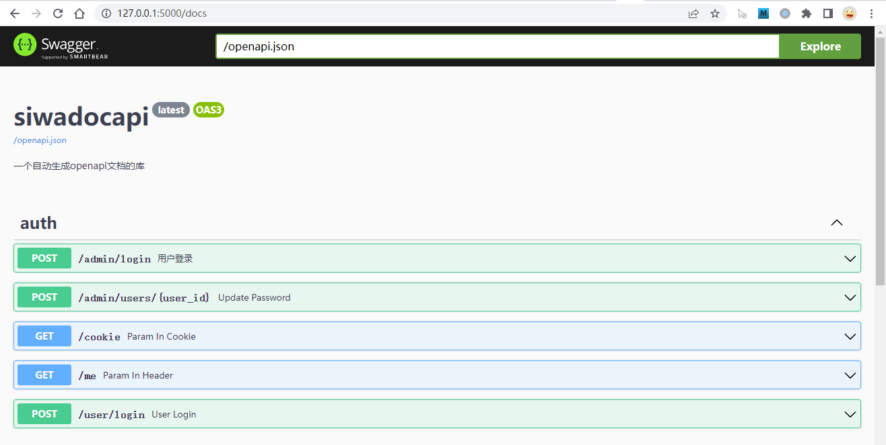
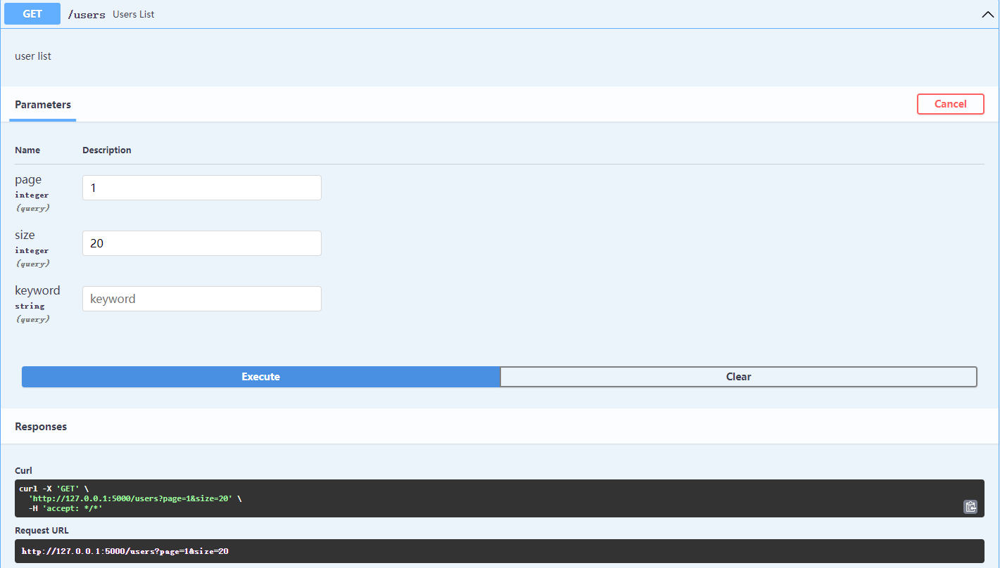
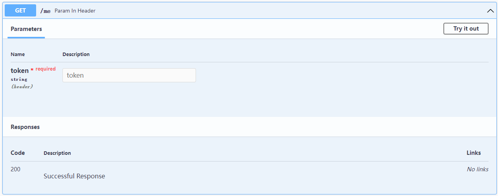
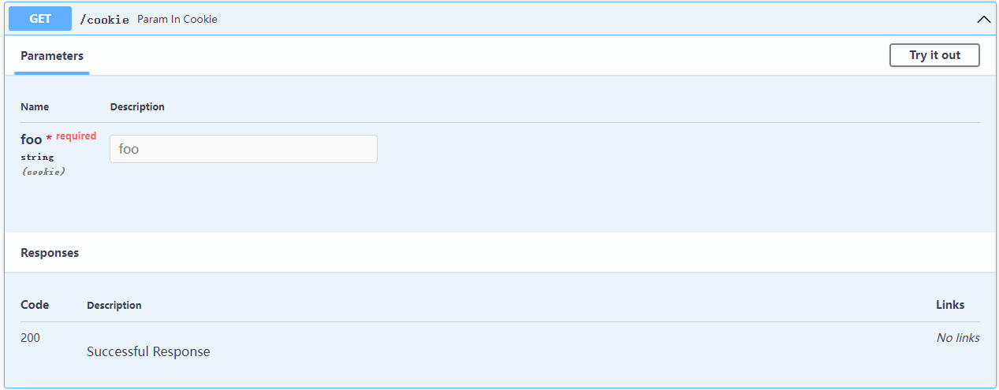
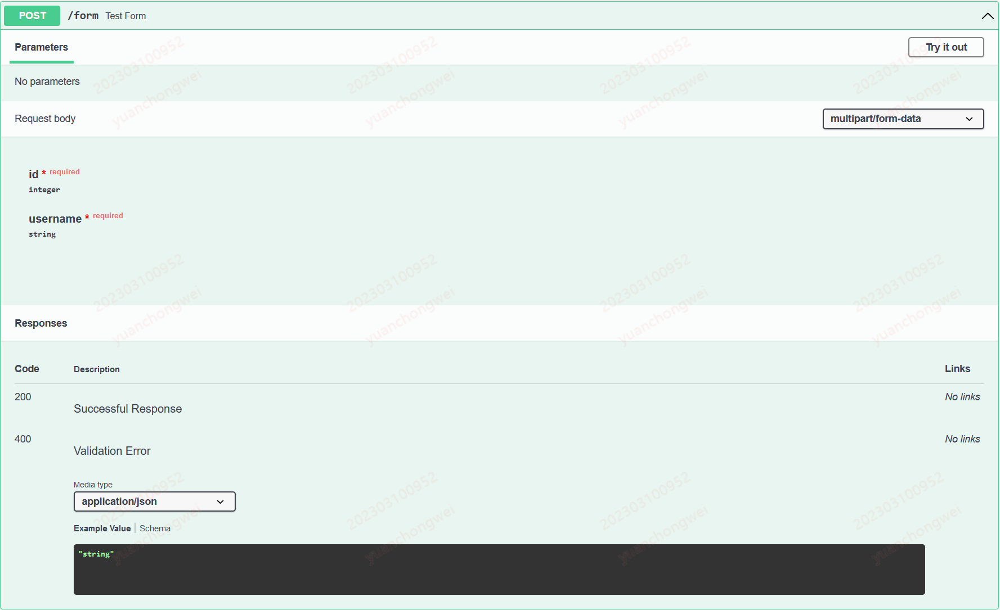
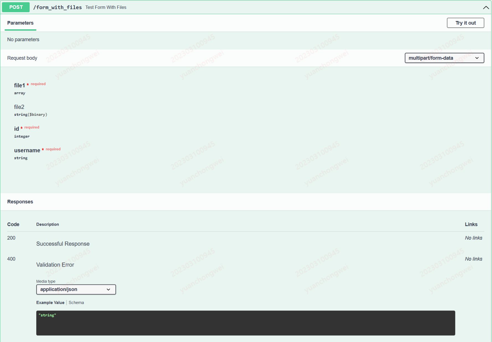
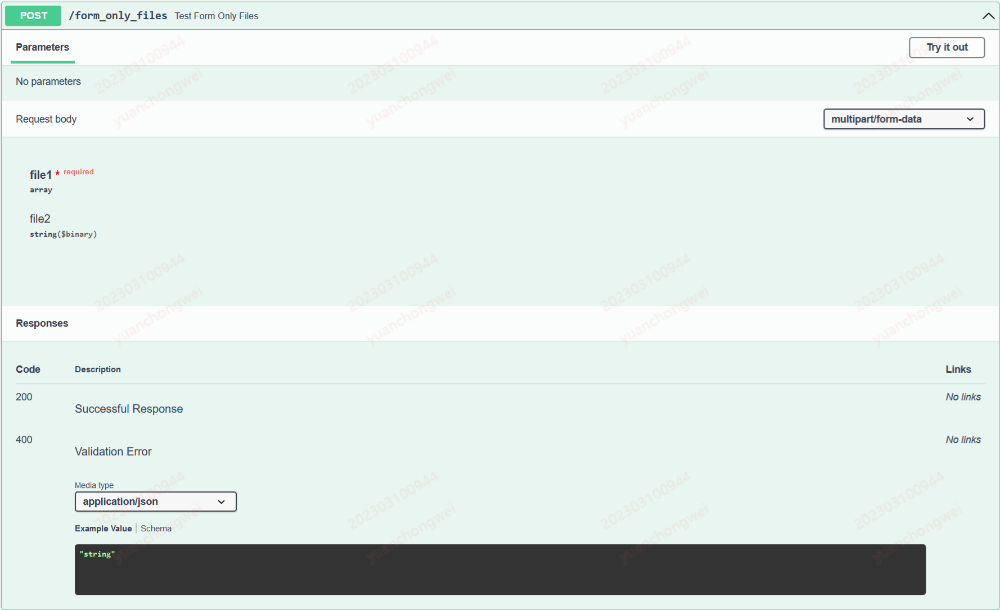
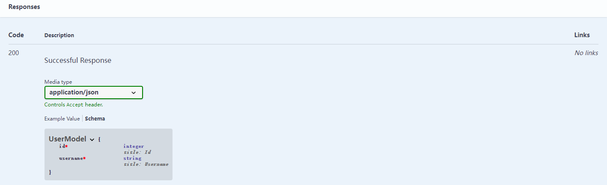
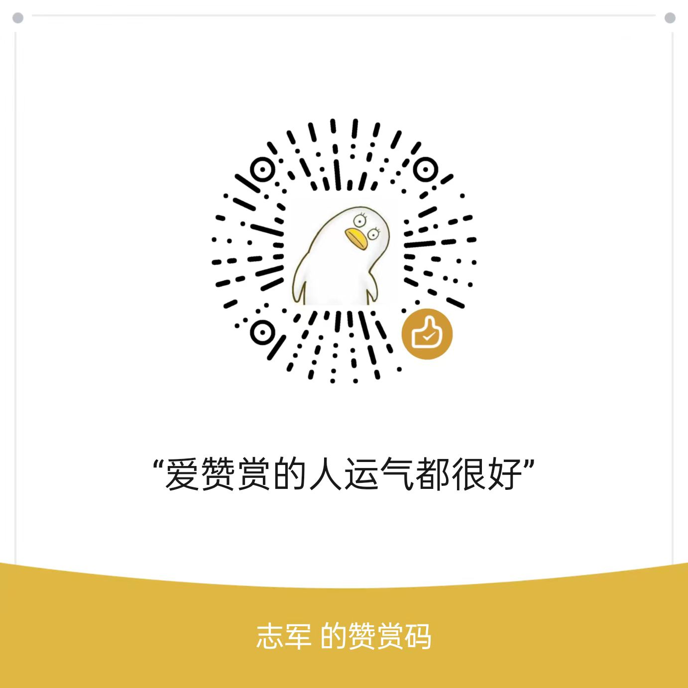

# flask-siwadoc

**flask-siwadoc**是一个兼具**数据校验**和openapi(swagger)**文档自动生成**的项目

## 特性

### 1、API接口自动生成文档

只需要初始化一个`siwa=SiwaDoc(app)`,利用装饰器 `siwa.doc()`修饰flask视图函数，即可将该视图对应的路由加入openapi的paths中。

### 2、支持多种参数指定

可以将请求参数放置在 `query`、`path`、`header`、`cookie`、`body(json、formdata)`5种不同的地方，完全支持openapi规范所定义的5种参数方式。

### 3、参数校验与自动转换

基于`pydantic`，请求参数可自动转换为对应的数据类型

### 4、ui切换

flask-siwadoc内置了`swagger`（默认）、`redoc`、`rapidoc`等多种UI界面

### 5、支持标签与分组

### 6、可设置访问权限

配置参数：
* SIWA_USER：登录用户名
* SIWA_PASSWORD: 登录密码

只有同时设置了用户名和密码访问文档才需要登录权限，该场景用在正式环境中，防止接口文档被匿名访问

## 安装

```
pip install flask-siwadoc
```

## 快速开始

### example 1

```python
from flask import Flask
from flask_siwadoc import SiwaDoc

app = Flask(__name__)
siwa = SiwaDoc(app, title="siwadocapi", description="一个自动生成openapi文档的库")


# 或者使用工厂模式
# siwa = SiwaDoc(title="siwadocapi", description="一个自动生成openapi文档的库")
# siwa.init_app(app)


@app.route("/hello", methods=["GET"])
@siwa.doc()
def hello():
    return "hello siwadoc"


if __name__ == '__main__':
    app.run()
```

运行后，访问 [http://127.0.0.1:5000/docs](http://127.0.0.1:5000/docs) 就可以看到openapi文档页面



### example 2：指定 query 参数
```python
from pydantic import BaseModel, Field

USERS = [
    {"username": "siwa1", "id": 1},
    {"username": "siwa2", "id": 2},
    {"username": "siwa3", "id": 3},
]


class QueryModel(BaseModel):
    page: int = Field(default=1, title="current page number")
    size: int = Field(default=20, title="size of page", ge=10, le=100)
    keyword: str = None


@app.route("/users", methods=["GET"])
@siwa.doc(query=QueryModel, tags=["user"], group="user")
def users_list(query: QueryModel):
    """
    user list
    """
    print(query.page)  # 1
    return {"data": USERS[:query.size]}
```

以查询参数方式接收数据时，例如：`/path?page=1&size=10`

1. 定义一个继承自`pydantic.BaseModel`的子类：`QueryModel`
2. `@siwa.doc(query=QueryModel)` ：`doc`装饰器中接收名为`query`的对象，用于在文档中展示参数列表
3. `users_list(query: QueryModel)` 视图函数中定义名字为`query`的参数，主要是方便开发者直接通过`query`对象获取参数值



### example3: 指定 header 参数

```python
class TokenModel(BaseModel):
    token: str


@app.route("/me", methods=["GET"])
@siwa.doc(header=TokenModel, tags=['auth'], group='admin')
def param_in_header():
    token = request.headers.get("token")
    print("token:", token)
    return {"token": token}
```

header中的参数可直接通过 `request.headers.get` 获取



### example4:指定 cookie 参数

```python
class CookieModel(BaseModel):
    foo: str


@app.route("/cookie", methods=["GET"])
@siwa.doc(cookie=CookieModel, tags=['auth'], group='admin')
def param_in_cookie():
    foo = request.cookies.get("foo")
    print("foo:", foo)
    return {"foo": foo}

```



### example5 :指定请求 body

以请求body接收数据时，例如：

```shell
curl -X 'POST' \
  'http://127.0.0.1:5000/user/login' \
  -H 'accept: */*' \
  -H 'Content-Type: application/json' \
  -d '{
  "password": "string",
  "username": "string"
}'
```

```python
class LoginModel(BaseModel):
    username: str
    password: str


@app.route("/user/login", methods=["POST"])
@siwa.doc(body=LoginModel, tags=['auth'])
def user_login(body: LoginModel):
    return {
        "username": body.username,
        "password": body.password,
        "id": 1}
```

1. 定义一个继承自`pydantic.BaseModel`的子类：`LoginModel`
2. `@siwa.doc(body=LoginModel)` ：`doc`装饰器中接收名为`body`的对象，用于在文档中展示参数列表
3. `users_list(body: LoginModel)` 视图函数中定义名字为`body`的参数，方便开发者直接通过`body`对象获取参数值


### example6: 使用formdata请求

example5中使用`json`作为请求体，当请求文件等复杂数据类型时，需要使用`formdata`

#### 情形一：没有文件等复杂数据类型时，例如
```python
class UserModel(BaseModel):
    id: int
    username: str


@app.post('/form')
@siwa.doc(form=UserModel)
def test_form(form: UserModel):
    print(form.id)
    print(form.username)
    return form.username
```
1. 定义一个继承自`pydantic.BaseModel`的子类：`UserModel`
2. `@siwa.doc(form=UserModel)` ：`doc`装饰器中接收名为`form`的对象，用于在文档中展示参数列表
3. `test_form(form: UserModel)` 视图函数中定义名字为`form`的参数，方便开发者直接通过`form`对象获取参数值



#### 情形二：请求体中包含基础数据类型数据，也包含文件对象参数时，例如：
```python

@app.post('/form_with_files')
@siwa.doc(form=UserModel, files={'file1': {"required": True, "single": False}, 'file2': {"required": False, "single": True}})
def test_form_with_files(form: UserModel, files: dict):
    print(form.id)
    print(form.username)
    print(files.keys())
    return form.username
```
1. 定义一个继承自`pydantic.BaseModel`的子类：`UserModel`
2. `@siwa.doc(form=UserModel, files={'file1': {"required": True, "single": False}, 'file2': {"required": False, "single": True}})` ：`doc`装饰器中接收名为`form`的对象、名为`files`的字典。`form`对象用于在文档中展示参数列表，`files`字典用于定义文件参数列表以及文件参数配置（`required`配置此文件参数是否必传，默认`False`；`single`配置此文件参数接收单文件还是文件列表，默认`True`）
3. `test_form_with_files(form: UserModel, files: dict)` 视图函数中定义名字为`form`的参数，方便开发者直接通过`form`对象获取基本数据类型的参数值; `files`字典用于获取文件对象



#### 情形三：请求体中只包含文件对象参数时，例如：
```python

@app.post('/form_only_files')
@siwa.doc(form=BaseModel, files={'file1': {"required": True, "single": False}, 'file2': {"required": False, "single": True}})
def test_form_only_files(files: dict):
    print(files.keys())

    return 'success'
```

1. `@siwa.doc(form=BaseModel, files={'file1': {"required": True, "single": False}, 'file2': {"required": False, "single": True}})` ：`doc`装饰器中接收名为`form`的对象、名为`files`的字典。`form`对象指定为基类`BaseModel`，`files`同情形二
2. `test_form_only_files(files: dict)` 视图函数中定义名字`files`的字典，用于获取文件对象



### example7: 指定返回体 responses

需要告诉客户端接口返回的字段时，指定参数`resp`

```python
class UserModel(BaseModel):
    id: int
    username: str


@app.route("/users", methods=["GET"])
@siwa.doc(query=QueryModel, resp=UserModel)
def users_list(query: QueryModel):
    """
    user list
    """
    return {"data": USERS[:query.size]}
```

1. 定义一个继承自`pydantic.BaseModel`的子类：`UserModel`
2. `@siwa.doc(resp=UserModel)` ：`doc`装饰器中接收名为`resp`的对象，用于在文档中展示返回的字段列表



### example8: 指定标签分类 tags

项目中如果接口太多，我们可以对接口根据业务划分不同的模块标签来分类管理。

```python
@siwa.doc(resp=UserModel, tags=["user"])
```

指定`tags`参数，tags参数是一个列表，一个接口可支持多个标签。


### example9: 指定分组  group

除了可以指定标签外，我们还可以指定分组

```python
@app.route("/admin/login", methods=["POST"])
@siwa.doc(body=LoginModel, resp=UserModel, tags=['auth'], group='admin')
def admin_login(body: LoginModel):
    return {"username": body.username, "id": 1}
```


完整示例可参考 [example.py](./example/__init__.py)

### UI切换

文档默认使用`swagger`进行渲染，你可以在路径上指定参数`?ui=swagger`切换成 `swagger` 渲染文档。

```python
http://127.0.0.1:5000/docs/?ui=swagger
```


### 扩展

数据校验报错时，flask-siwadoc 会抛出异常`flask_siwadoc.error.ValidationError`，ValidationError 继承自`pydantic.ValidationError`

例如：

```python

class QueryModel(BaseModel):
    keyword: str


@app.route("/users", methods=["GET"])
@siwa.doc(query=QueryModel, tags=["user"])
def hello(query: QueryModel):
    print(query)
    return "hello"
```

该接口中，keyword是必选的查询参数，如果url中没有keyword参数，就会抛出异常

```
raise ValidationError(e)
flask_siwadoc.error.ValidationError: 2 validation errors for Auth
    username
field required (type=value_error.missing)
password
field required (type=value_error.missing)
```

使用flask的 `errorhandler()` 装饰函数来注册`ValidationError`错误，这样错误异常就可以被`validate_error`函数捕获，开发者可以给前端直接一个友好的错误响应体

```python
@app.errorhandler(ValidationError)
def validate_error(e: ValidationError):
    return dict(code=-1, msg="请求参数错误", error_info=e.errors()), 400
```


reference

1. https://pydantic-docs.helpmanual.io/
2. https://github.com/tiangolo/fastapi
3. https://github.com/bauerji/flask-pydantic
4. https://github.com/kemingy/flaskerk

任何问题欢迎发issue或者加我微信 lzjun567 交流，欢迎PR， 如果对你有帮助或者给你的工作带来了极大的便利，可考虑赞赏作者


