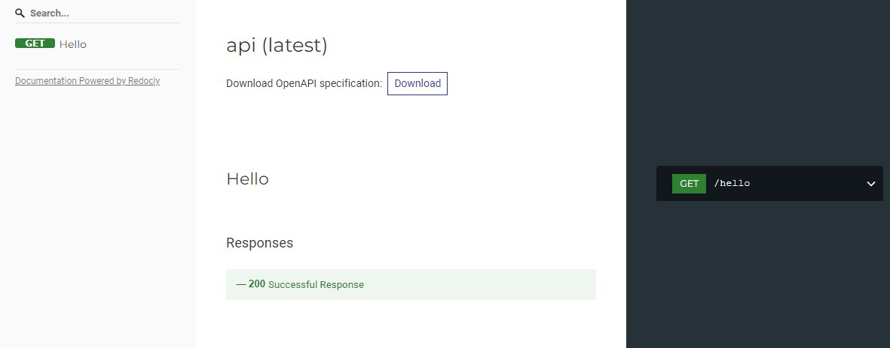
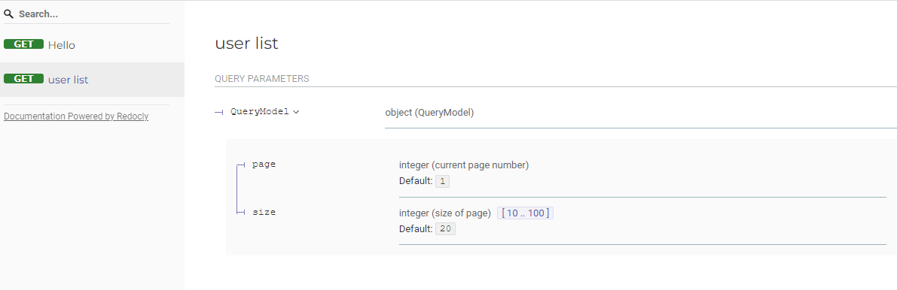
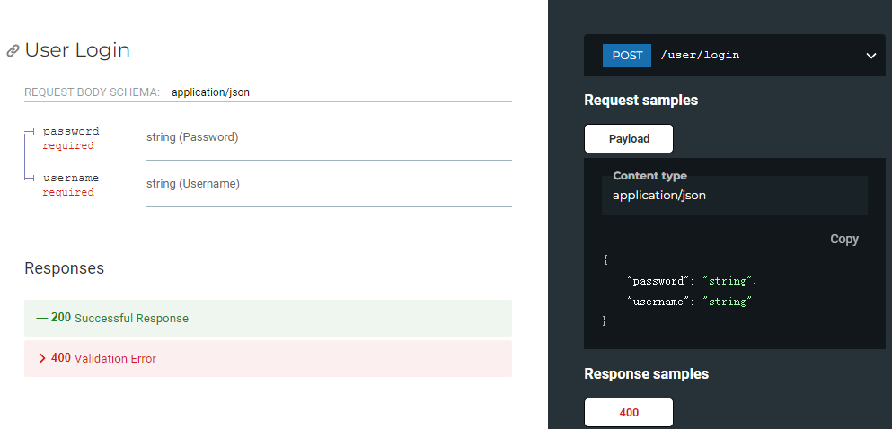
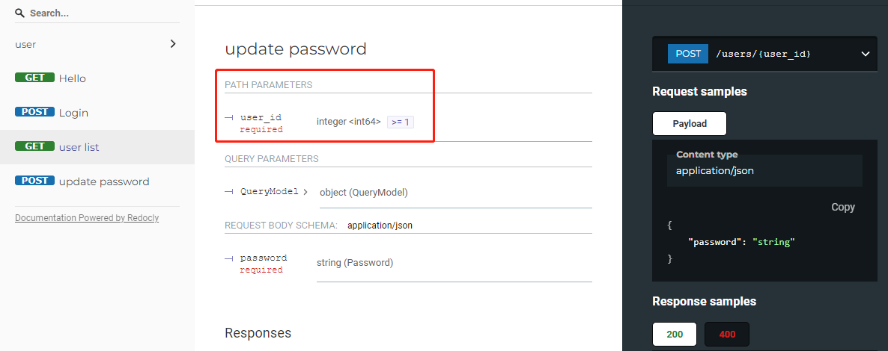
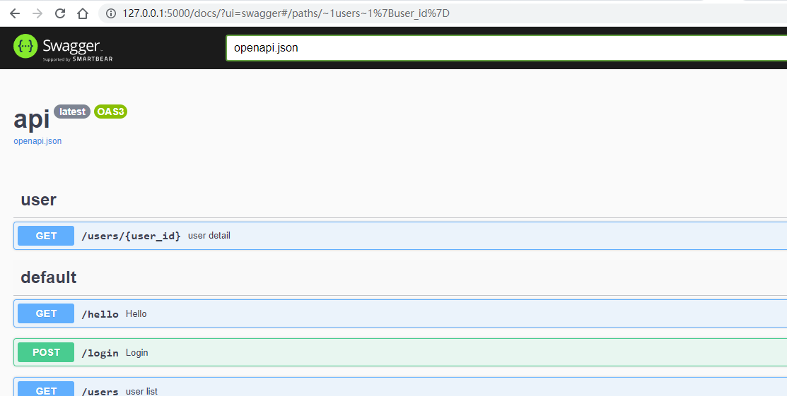
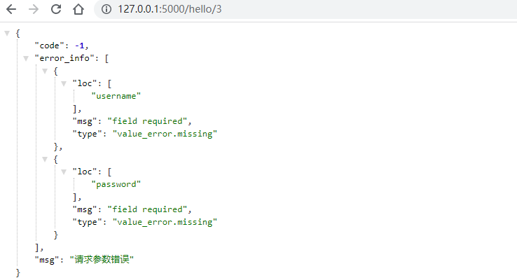

# flask-siwadoc

**flask-siwadoc** 是一个兼具**数据校验**和openapi(swagger)**文档自动生成**的项目

## 特性

### 0、零配置

接入flask-siwadoc无需任何配置

### 1、数据校验

flask-siwadoc 站在巨人肩膀上，数据校验利用`pydantic`强大的数据验证功能，支持请求**查询参数**和**请求体参数**的数据校验及转换功能。因此本项目同时依赖于pydantic。

### 2、接口文档自动生成

接口文档生成只需要简单初始化一个`siwa=SiwaDoc(app)`,利用装饰器 `siwa.doc()`修饰flask的视图函数，即可将该视图函数加入openapi的接口文档规范中。

### 3、ui切换

flask-siwadoc内置了`redoc`、`swagger`、`rapidoc`等多种UI界面，通过参数`/docs/?ui=xxx`切换

### 4、文档支持分组与标签

## 安装

```
pip install flask-siwadoc
```

## 快速开始

### example 1

```python
from flask import Flask
from flask_siwadoc import SiwaDoc

app = Flask(__name__)

siwa = SiwaDoc(app)


# or
# siwa.init_app(app)

@app.route("/hello", methods=["GET"])
@siwa.doc()
def hello():
    return "hello siwadoc"


if __name__ == '__main__':
    app.run()
```

运行后，访问 [http://127.0.0.1:5000/docs](http://127.0.0.1:5000/docs) 就可以看到openapi的文档页面



### example 2：指定查询参数 query

```python
from pydantic import BaseModel, Field


class QueryModel(BaseModel):
    page: int = Field(default=1, title="current page number")
    size: int = Field(default=20, title="size of page", ge=10, le=100)


@app.route("/users", methods=["GET"])
@siwa.doc(query=QueryModel, tags=['user'])
def users_list():
    """
    user list
    """
    return [{"username": "siwa", "id": 1}]
```

对于数查询接口，`GET`请求需如果有查询参数，得益于pydantic强大的类型功能，我们只需要一个继承了BaseModel的自定义类，即可实现数据校验及转换。

如何在视图函数中使用该`query`这个对象呢？ 有两种方式

方式一：

```python
@app.route("/users", methods=["GET"])
@siwa.doc(query=QueryModel, tags=["user"])
def hello():
    print(request.query.keyword)
    return "hello"
```

flask-siwadoc 将QueryModel的实例对象`query`绑定到了flask的request对象上，不过对开发者来说使用并不友好，你没法知道它的类型是什么，意味着IDE无法用`.`的方式调出该实例的属性。

方式二：（推荐方式）

```python
@app.route("/users", methods=["GET"])
@siwa.doc(query=QueryModel, tags=["user"])
def hello(query: QueryModel):
    print(query.keyword)
    return "hello"
```

将`query`变量作为视图函数的参数，flask-siwadoc 会自动将QueryModel实例对象赋值给`query`变量，因为我们这里给query指定了类型声明，因此通过IDE可以很方便的调出实例属性。

下面的example3中的body参数原理也是类似的。



### example3 :指定请求体 body

```python
class LoginModel(BaseModel):
    username: str
    password: str


@app.route("/login", methods=["POST"])
@siwa.doc(body=LoginModel)
def login(body: LoginModel):
    return {"username": body.username, "id": 1}
```

对于POST请求，请求体是基于application/json 类型， 会自动转换成LoginModel类型的对象，就可以用静态语言一样，通过点选的方式调出属性，例如 `body.username`



### example4: 指定返回体 resp

```python
class UserModel(BaseModel):
    id: int
    username: str


@app.route("/users/1", methods=["GET"])
@siwa.doc(resp=UserModel)
def users():
    """
    user detail
    """
    return {"username": "siwa", "id": 1}
```


### example5: 指定标签分类 tags

项目中如果接口太多，我们可以对接口根据业务划分不同的模块标签来分类管理。

```python
@siwa.doc(resp=UserModel, tags=["user"])
```

指定`tags`参数，tags参数是一个列表，一个接口可支持多个标签。

### example6：路径参数也支持文档化

针对参数，除了请求查询参数和请求体参数外，url路径中的参数，例如`/users/<int(min=1):user_id>` 同样支持，对于路径参数转api文档参数，不需要开发者做额外的处理，flask-siwadoc内部已经做了处理。

```python
class QueryModel(BaseModel):
    gender: str


class UpdatePasswordModel(BaseModel):
    password: str


@app.route("/users/<int(min=1):user_id>", methods=["POST"])
@siwa.doc(query=QueryModel, body=UpdatePasswordModel, resp=UserModel)
def update_password(user_id):
    """
    update password
    """
    return {"username": "siwa", "id": user_id}
```



完整示例可参考 [example.py](./example/__init__.py)

### UI切换

文档默认使用`redoc`进行渲染，你可以通过指定参数`ui=swaggerui`显式文档。

```python
http: // 127.0
.0
.1: 5000 / docs /?ui = swagger
```



## 扩展

如果数据校验报错，flask-siwadoc 会抛出异常`flask_siwadoc.error.ValidationError`，ValidationError 继承自`pydantic.ValidationError`

例如：

```python

class QueryModel(BaseModel):
    keyword: str


@app.route("/users", methods=["GET"])
@siwa.doc(query=QueryModel, tags=["user"])
def hello(query: QueryModel):
    print(query)
    return "hello"
```

该接口中，keyword是必选的查询参数，如果url中没有keyword参数，就会抛出异常

```
    raise ValidationError(e)
flask_siwadoc.error.ValidationError: 2 validation errors for Auth
    username
field required (type=value_error.missing)
password
field required (type=value_error.missing)
```

我们需要通过使用flask的 errorhandler() 装饰函数来注册`ValidationError`错误，这样错误异常就可以被`validate_error`函数捕获，开发者可以给前端直接一个友好的错误响应体

```python
@app.errorhandler(ValidationError)
def validate_error(e: ValidationError):
    return dict(code=-1, msg="请求参数错误", error_info=e.errors()), 400
```



reference

1. https://pydantic-docs.helpmanual.io/
2. https://github.com/bauerji/flask-pydantic
3. https://github.com/kemingy/flaskerk

任何问题欢迎发issue或者加我微信 lzjun567 交流，欢迎PR